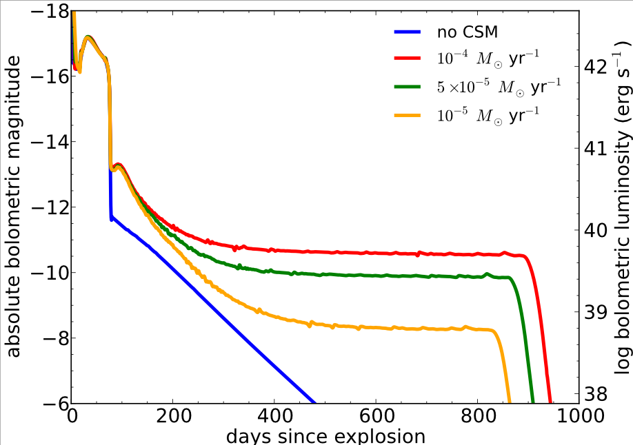
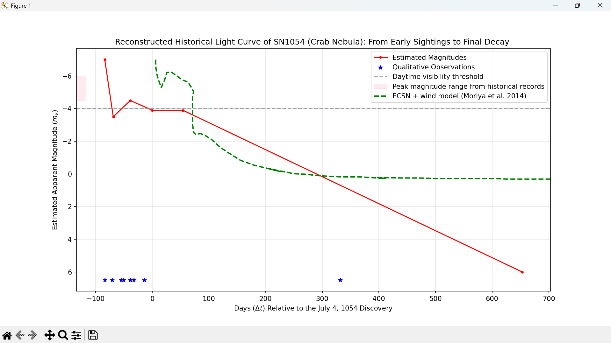

# Reconstructing the Light Curve of SN 1054: Testing the Electron-Capture Supernova Hypothesis

Author: Vytamyn (CVN)

Date: July 14, 2026

## Abstract
The light curve of SN 1054 (Crab Nebula) is reconstructed from historical 
records and compared to theoretical electron-capture supernova (ECSN) models.
While the available data points are limited, the reconstructed light curve 
shows a shape that does not contradict the ECSN classification. This 
suggests that SN 1054 could potentially be an electron-capture supernova, 
though additional data is needed for a definitive conclusion.

## Introduction
SN 1054 —the supernova that created the Crab Nebula— was observed by Chinese,
Japanese, and Arab astronomers in 1054 CE. According to Shklovsky (1968), as 
cited by Ruffini and Sigismondi (2024), Chinese records align with Japanese 
accounts, describing a "guest star" that was visible during daylight for 23 
days and remained visible to the naked eye for nearly two years (21 months 
of total visibility).

Despite extensive study, the classification of SN 1054 remains debated 
(Horvath, 2022). One proposed explanation is that SN 1054 
was an **electron-capture supernova (ECSN)** — a rare type of stellar 
explosion triggered by electron-capture reactions in the core of a 
super-asymptotic giant branch (super-AGB) star (Moriya et al., 2014).

This project reconstructs the supernova's light curve from primary 
historical sources and compares it to modern theoretical models of 
electron-capture supernovae to evaluate whether SN 1054 fits this classification.

## Composition
This program consists of 3 support files and 1 main file to run.

1. data_extract.py
2. data_control.py
3. plot.py
4. main.py

All are written in Python. Version 3.0+ is strongly recommended.

**IMPORTANT:** This is **NOT** open-source. See **[License & Copyright](#license--copyright)** section.

## Methodology
1. **Historical Research**: Extracted brightness descriptions from a summary 
   of historical records by Martocchia and Polcaro (2010). Duration 
   estimates were compared to the variation in the absolute magnitude of the 
   remnant over time (Breen & McCarthy, 1995, cited in Horvath, 2022)

2. **Day Difference Calculation**: Days were calculated relative to July 4, 
   1054, as historical records are inconsistent and not always verifiable.

3. **Data Extraction**: Digitized the ECSN model curve from Moriya et al. 
   2014 (Figure 1) using WebPlotDigitizer.

4. **Alignment**: Shifted the model vertically to match the historical 
   peak magnitude for visual comparison (roughly)

5. **Visualization**

## Execution
To reproduce the result, run the file **main.py**

## Results

Figure 1: Reconstructed light curve of SN 1054 from historical records, 
overlaid with the ECSN model from Moriya et al. 2014.

## Findings
- The historical peak is shown at magnitude -7.0
- The supernova remained visible to the naked eye for approximately 625 days.
- The shape of light curve shows the potential of being categorized as 
  electron-capture supernova.

## Limitation
Due to the inconsistent nature of historical records, brightness magnitudes 
can only be estimated. Some records were treated as qualitative observations 
rather than precise measurements.

Additionally, the plateau phase of the light curve could not be clearly 
illustrated due to a lack of credible data in this region. While the ECSN 
model predicts a distinct plateau, the sparsity of historical records during 
this period limits direct comparison.

## Contact & Support
**Email**: vytamynv@gmail.com

**Report bug**: [Github Issues] https://github.com/vytamynv/crabnebula/issues

## License & Copyright

**Copyright © 2026 Vytamynv. All Rights Reserved.**

This project and its source code are made publicly visible for reference and educational purposes only.

**Permitted Use:** ✅
- Viewing the source code
- Forking the repository on GitHub (as permitted by GitHub's Terms of Service)

**You are NOT permitted to:** 🚫
- Copy, reproduce, or distribute any part of this code
- Modify, adapt, or create derivative works
- Use this code in any personal, commercial, or open-source project

without explicit prior written permission from the author.

**Disclaimer:** This software is provided "as is," without warranty of any kind, express or implied.

For permission requests, please contact: vytamynv@gmail.com

## References

Horvath, J. E. (2022). A precursor interpretation for the Crab supernova 
1054 A.D. very early light curve. Astrophysics and Space Science, 367(8). https://doi.org/10.1007/s10509-022-04115-9

Martocchia, A. ; Polcaro, V. F. (2010). GRB 080319b and SN1054. Memorie 
 della Società Astronomica Italiana Supplement, v.14, p.242. https://ui.adsabs.harvard.edu/abs/2010MSAIS..14..242M/abstract

Moriya, T. J., Tominaga, N., Langer, N., Nomoto, K., Blinnikov, S. I., & 
Sorokina, E. I. (2014). Electron-capture supernovae exploding within their 
progenitor wind. Astronomy & Astrophysics, 569, A57. https://doi.org/10.1051/0004-6361/201424264

Ruffini, R., & Sigismondi, C. (2024). Fitting the Crab Supernova with a 
Gamma-Ray Burst. Universe, 10(7), 275. https://doi.org/10.3390/universe10070275
